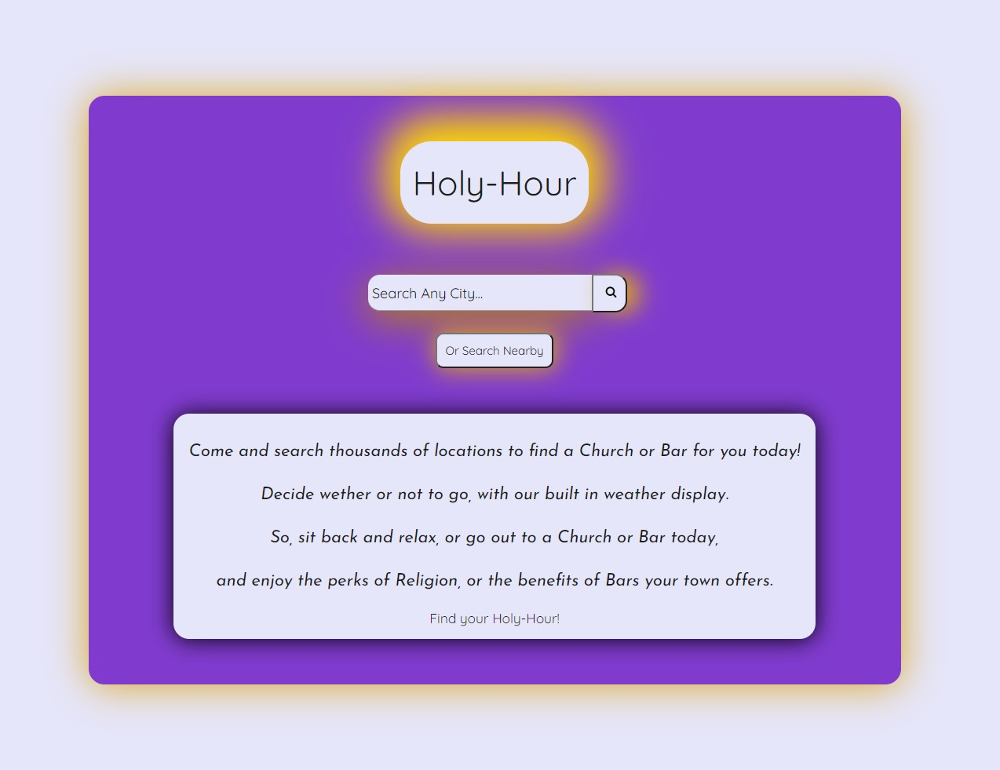
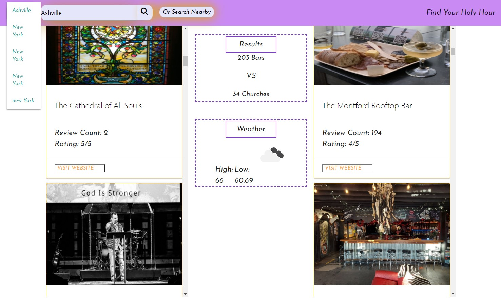
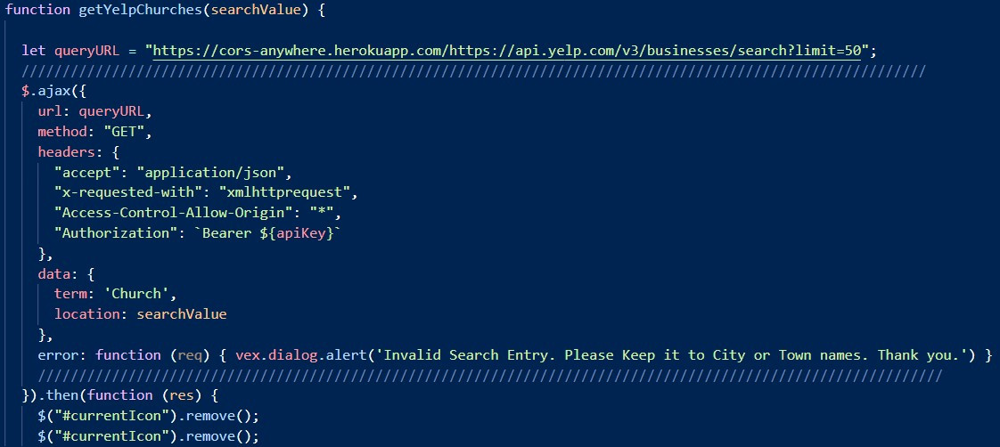
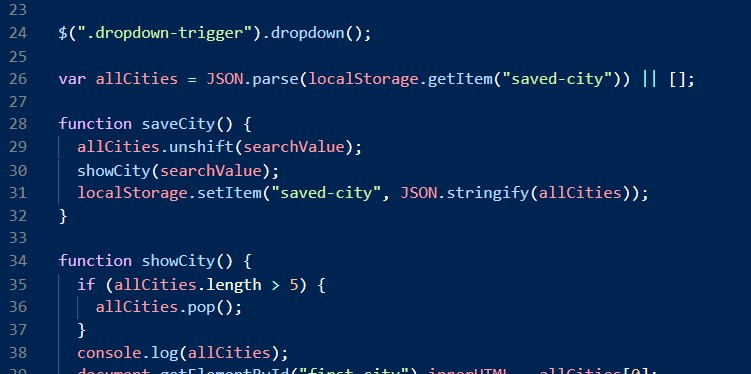

# holy-hour

A site to compare the amount of bars and the amout of churches a town or city has, within a 5 mile radius.
See review count as well as location rating, and get currently updated weather for that locatoin.

## Built With

* [HTML](https://developer.mozilla.org/en-US/docs/Web/HTML)
* [CSS](https://developer.mozilla.org/en-US/docs/Web/CSS)
* [Javascript](https://developer.mozilla.org/en-US/docs/Web/JavaScript)

* [Jquery](https://jquery.com/)
* [JqueryUI](https://jqueryui.com/)

* [VEX](https://github.com/HubSpot/vex)

* [MaterializeCSS](https://materializecss.com/badges.html)
* [FontAwesome](https://fontawesome.com/)

* [ipify](https://www.ipify.org/)
* [ip-api](https://ip-api.com/)
* [YelpFusionAPI](https://www.yelp.com/fusion)
* [Open_Weather_Map_One_Call_API](https://openweathermap.org/api/one-call-api)

## Deployed Link

* [See Live Site](https://divinemayura.github.io/holy-hour/)

## Authors

* **Erik Gustuson**

- [Link to Portfolio Site](https://erikgustuson.github.io/basic-portfolio/)
- [Link to Github](https://github.com/ErikGustuson)
- [Link to LinkedIn](https://www.linkedin.com/in/erik-gustuson/)

* **May Faucher** 

- [Link to Portfolio Site](https://divinemayura.github.io/)
- [Link to Github](https://github.com/DivineMayura)
- [Link to LinkedIn](https://www.linkedin.com/in/mayfaucher)

* **Mehdi Safari**

- [Link to Portfolio Site](https://mehdisafari77.github.io/Basic-Bio/)
- [Link to Github](https://github.com/mehdisafari77)
- [Link to LinkedIn](https://www.linkedin.com/in/mehdi-safari-992799142/)

## License

This project is licensed under the MIT License 

## Images of Site:

